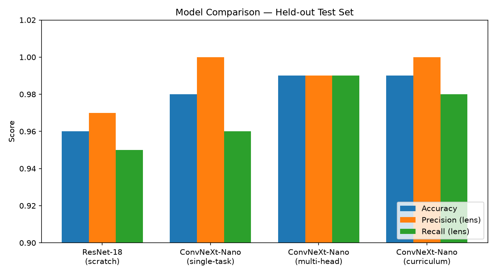

# Gravitational Lens Discovery Engine

A deep learning pipeline for detecting gravitational lenses in astronomical survey images, using a pretrained ConvNeXt backbone with interpretable confidence scores built into the model architecture via disentangled auxiliary heads — rather than added as post-hoc explanations.

## Problem

Strong gravitational lensing is scientifically valuable (dark matter mapping, Hubble constant constraints) but extremely rare — roughly 1 in thousands of galaxy images. Existing automated lens finders typically output a single probability score with no explanation of *why*, making it hard for astronomers to trust a model enough to commit expensive telescope follow-up time to a candidate.

## Approach

- **Physics-based synthetic data generation** using [lenstronomy](https://github.com/lenstronomy/lenstronomy), grounded in real SLACS survey parameter statistics (Bolton et al. 2008).
- **Real-injection pipeline**: synthetic lens signals injected into genuine HSC-SSP survey backgrounds, with an empirically-derived PSF (built by stacking multiple real stars from the field, not a generic Gaussian approximation) and exact galaxy-light subtraction for clean residuals.
- **Pretrained ConvNeXt-Nano backbone** (via [Zoobot](https://github.com/mwalmsley/zoobot), pretrained on real galaxy morphology), fine-tuned with a custom multi-head architecture: one classification head plus four auxiliary regression heads (Einstein-ring completeness, brightness asymmetry, colour gradient, arc elongation), trained with a masked multi-task loss so the auxiliary heads only apply where lensing structure genuinely exists.
- **Calibration**: temperature scaling plus a Bayesian prior-shift correction, since training uses class-balanced data but real surveys have ~1-in-5000 lens rarity.

## Results

| Model | Test Accuracy | Precision (lens) | Recall (lens) | Notes |
|---|---|---|---|---|
| ResNet-18 (from scratch) | 96% | 0.97 | 0.95 | Baseline |
| ConvNeXt-Nano (pretrained, single-task) | 98% | 1.00 | 0.96 | |
| ConvNeXt-Nano (multi-head, pretrained) | 99% | 0.99 | 0.99 | Best overall |
| ConvNeXt-Nano (curriculum-trained) | 99% | 1.00 | 0.98 | |

**Multi-head auxiliary interpretability heads improved core classification performance**, not just added explainability — likely because predicting real physical properties pushed the shared encoder toward genuinely relevant features rather than shortcut cues.

### Calibration finding

Temperature scaling improved test-set ECE from 0.0081 to 0.0051. More importantly: **a "99% confident" prediction under balanced training data corresponds to only ~1.9% real-world confidence** once corrected for true lens rarity (~1-in-5000) — the same statistical effect behind why accurate rare-disease tests still produce mostly false positives in absolute terms. This is why real lens-finding pipelines (e.g. Euclid's) rely on expert/citizen-science follow-up rather than a single model's raw confidence.

### Honest limitation: real-world generalization

Zero-shot testing against genuine confirmed SLACS lenses (grade-A, spectroscopically confirmed) found **37.5% recall (3/8)** — a real, substantial gap versus the ~99% synthetic test performance. Root-cause analysis using the full real SLACS population's published parameters (not just the 8 test examples) identified a specific cause: **the synthetic training data's lens ellipticity range was too narrow**, missing roughly the more elongated half of the real population (real axis ratio goes down to 0.51; synthetic training only reached ~0.72). This is a concrete, actionable gap, not just "simulation isn't reality."

## Tech Stack
PyTorch (CUDA), Zoobot / timm (ConvNeXt-Nano), lenstronomy, Astropy, Photutils, Astroquery, scikit-learn, Matplotlib

## Status
Core pipeline (data generation, injection, PSF matching, multi-head model, calibration, real-data validation) complete. Not yet packaged as an installable library or fine-tuned on a larger real-lens sample — see project notebooks for full week-by-week development history.